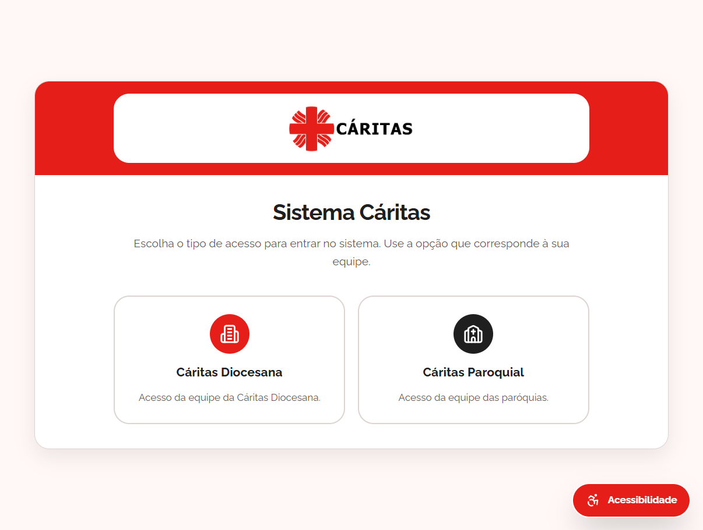
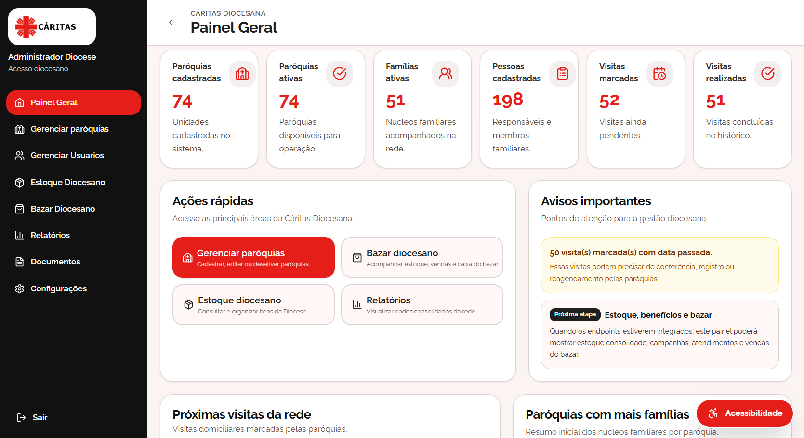
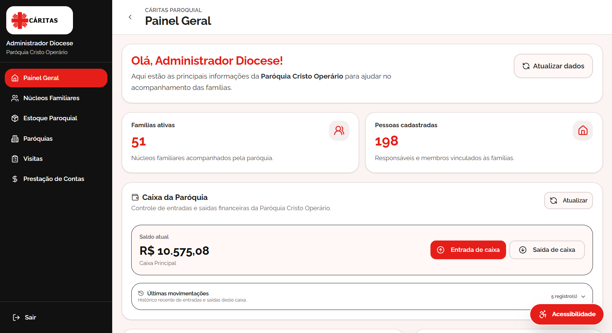

# Cáritas Diocesana — Frontend

Frontend do sistema **Cáritas Diocesana**, desenvolvido para apoiar a gestão de paróquias, famílias acompanhadas, visitas, estoque, entregas de cestas, caixa, bazar e demais funcionalidades administrativas.

O projeto foi desenvolvido com **React**, **TypeScript**, **Vite** e **Tailwind CSS**, consumindo uma API Laravel hospedada em ambiente externo.

## Links do projeto

- **Frontend:** este repositório
- **Backend:** https://github.com/LucasSchiochet2/caritas-system

## Tecnologias utilizadas

- React
- TypeScript
- Vite
- Tailwind CSS
- Axios
- pnpm

## Pré-requisitos

Antes de iniciar o projeto, é necessário ter instalado:

- Node.js
- npm
- pnpm instalado globalmente

Para verificar as versões instaladas:

```powershell
node -v
npm -v
pnpm -v
```

Caso o `pnpm` não esteja instalado, execute:

```powershell
npm install -g pnpm
```

## Instalação das dependências

Dentro da pasta `frontend`, execute:

```powershell
pnpm install
```

## Rodando o projeto em desenvolvimento

Para iniciar o ambiente de desenvolvimento:

```powershell
pnpm dev
```

O Vite deve iniciar o projeto e exibir no terminal um endereço parecido com:

```text
Local: http://localhost:5173/
```

Abra esse endereço no navegador para acessar o sistema.

## Build de produção

Para gerar a versão de produção:

```powershell
pnpm build
```

Os arquivos finais serão gerados na pasta:

```text
dist/
```

A pasta `dist` contém o frontend compilado, otimizado e pronto para publicação em um servidor web, como Nginx, Apache, IIS, cPanel, Vercel, Netlify ou outro serviço de hospedagem estática.

## Pré-visualizar build localmente

Após gerar o build, é possível pré-visualizar a versão de produção com:

```powershell
pnpm preview
```

## Estrutura principal do projeto

```text
frontend/
├── src/
│   └── app/
│       ├── api/            # Funções de integração com a API
│       ├── components/     # Componentes reutilizáveis
│       ├── config/         # Configurações e permissões
│       ├── pages/          # Páginas principais do sistema
│       ├── types/          # Tipagens TypeScript
│       └── utils/          # Funções auxiliares
├── public/
├── .env
├── package.json
├── pnpm-lock.yaml
└── vite.config.ts
```

## Scripts disponíveis

```powershell
pnpm dev
```

Inicia o projeto em modo desenvolvimento.

```powershell
pnpm build
```

Gera os arquivos finais para produção.

```powershell
pnpm preview
```

Executa uma prévia local do build de produção.

```powershell
pnpm lint
```

Executa a verificação de lint, caso configurada no projeto.

## Fluxo básico para rodar o projeto

```powershell
cd .\frontend
pnpm install
pnpm dev
```

Depois, acesse:

```text
http://localhost:5173/
```

## Funcionalidades principais

O sistema Cáritas Diocesana possui funcionalidades voltadas para o acompanhamento e organização das atividades realizadas pela diocese e pelas paróquias.

Entre os principais módulos estão:

- autenticação por tipo de acesso;
- painel geral da diocese;
- painel geral da paróquia;
- gestão de paróquias;
- gestão de usuários;
- cadastro e acompanhamento de núcleos familiares;
- gestão de visitas;
- estoque paroquial;
- entregas de cestas;
- movimentações de caixa da paróquia;

## Screenshots

### Tela inicial



### Painel geral da diocese



### Painel geral da paróquia



## Observações importantes

- Todos os comandos devem ser executados dentro da pasta `frontend`.
- O projeto utiliza `pnpm` como gerenciador de pacotes padrão.
- Rodar `pnpm dev` na raiz do repositório pode não funcionar caso o `package.json` esteja apenas dentro da pasta `frontend`.
- O script `dev` executa o Vite.
- A URL da API deve estar configurada corretamente no arquivo `.env`.
- Não versionar arquivos sensíveis de ambiente com dados privados.
- Em produção, o servidor deve estar preparado para servir aplicações SPA.

## Autores

| Autor                  | GitHub                                                 | Participação |
| ---------------------- | ------------------------------------------------------ | ------------ |
| Anderson Pastore Rizzi | [@andersonprizzi](https://github.com/andersonprizzi)   | Collaborator |
| Davi dos Santos        | [@Davi193](https://github.com/Davi193)                 | Collaborator |
| Lucas Schiochet        | [@LucasSchiochet2](https://github.com/LucasSchiochet2) | Collaborator |
| Yuri Sabedot Venturin  | [@YSVenturin](https://github.com/YSVenturin)           | Collaborator |
